# API for a Coupon Book Service

## 🏃‍♂️ **Running the Server Locally**

To run the application locally, follow these steps:

**Clone the repository**:
```bash
   git clone <your-repository-url>
   cd <your-project-folder>
   npm run start:env or docker compose up
   http://localhost:3000/
```

**👤 Test Users**:

```bash
Admin User:
Email: admin@admin.com
Password: Password1

Regular User:
Email: user@user.com
Password: Password1
```

## System Architecture

This system utilizes **two workers**:

1. **API Worker**: Handles all API requests and user interactions.
2. **Processing Worker**: Responsible for the heavy task of generating codes, ensuring that this process does not affect the responsiveness of the API.

By having these two separate workers, the system is able to handle high volumes of async code generation requests without the risk of downtime or performance degradation, as the API and code generation processes are handled independently.

### Concurrency Management with Redis and MongoDB Transactions

This system implements concurrency management using **Redis** and **MongoDB Transactions** to ensure that critical operations are performed safely and without conflicts, especially during high-volume operations like code generation or assignment.

#### Redis for Locking:
To handle concurrent access to resources, **Redis** is used as a distributed locking mechanism. The system uses Redis to lock resources (such as a coupon or coupon book) before processing a task, ensuring that only one operation can modify the resource at a time.

1. **Locking**: When an operation needs to access a resource, a lock is acquired using Redis' `SET` command with the `NX` (set if not exists) and `EX` (expiration time) options. This prevents multiple processes from attempting to modify the same resource simultaneously.
   
   For example, when assigning a coupon, the system checks if the coupon is locked. If it is locked, the process waits or returns an error indicating that the resource is currently being processed by another task.

2. **Lock Expiration**: The lock has an expiration time to avoid deadlocks in case something goes wrong during the process. Once the task is completed, the lock is released, allowing other operations to proceed.

This locking mechanism ensures that only one process can assign or modify a coupon at a time, preventing race conditions and ensuring data consistency.

#### MongoDB Transactions:
In addition to Redis-based locking, the system also utilizes **MongoDB Transactions** to guarantee the atomicity of operations involving multiple documents or collections. MongoDB Transactions allow multiple operations to be grouped into a single transaction that either succeeds or fails as a whole.

1. **Atomic Operations**: For operations such as coupon assignment or redemption, where multiple documents need to be updated (e.g., updating a `UserCoupon` and a `Coupon`), MongoDB transactions ensure that either both documents are updated successfully, or neither is updated in case of an error.

2. **Transaction Management**: The system starts a MongoDB session and transaction before performing the database operations. If any part of the transaction fails, all changes are rolled back, ensuring consistency. If the transaction succeeds, the changes are committed to the database.

Using MongoDB Transactions in combination with Redis locking provides a robust mechanism to ensure that the system operates correctly under high concurrency and that data integrity is maintained even when multiple requests are processed simultaneously.

#### Example Workflow:
1. A user requests to assign a coupon.
2. The system acquires a Redis lock to ensure no other process can assign the same coupon.
3. The system starts a MongoDB transaction to update both the `Coupon` and `UserCoupon` documents atomically.
4. If the operation is successful, the lock is released, and the transaction is committed.
5. If any step fails, the transaction is rolled back, and the lock is released.

This approach ensures that the system can scale and handle a high number of concurrent operations while maintaining data consistency and preventing conflicts.

## Security

The security of the endpoints is implemented using **JWT (JSON Web Tokens)**, which ensures secure authentication and authorization.  

In the **development environment**, a **shared secret (HS256)** is used to sign tokens. However, in a **production environment**, it is recommended to use the **RS256** algorithm, which relies on a **public-private key pair** for enhanced security.

- **Private key**: Used to sign the tokens and must be kept secure.  
- **Public key**: Used to verify the tokens and can be safely distributed.  

To further improve security, these keys should be stored in a **secure secret management service**, such as **AWS Secrets Manager** or **Google Cloud Secret Manager**. This approach ensures proper credential management, facilitates key rotation, and enhances overall system security.


## System Architecture Diagram

```mermaid
graph TD;
    A["Cliente API"]-->B["API Gateway / Load Balancer"]
    B-->C["Servicio de API (Node.js)"]
    C-->D["Capa de Servicios"]
    
    subgraph "Base de Datos y Cache"
      D-->E["MongoDB (Base de Datos - Transacciones)"]
      D-->F["Redis (Bloqueos Distribuidos, Caché, Rate Limiting)"]
    end
    
    subgraph "Mensajería y Tareas en Background"
      D-->G["RabbitMQ (Mensajería)"]
      G-->H["Consumidores (Workers - Procesamiento Asíncrono)"]
      H-->E
      H-->F
    end

    C-->I["Servicio de Generación de Códigos"]
    C-->J["Servicio de Autenticación"]
    
    subgraph "Monitoreo y Seguridad"
      C-->K["Rate Limiting y Logs"]
    end
```


## Database Diagram


### Deployment

This system can be deployed on **AWS EKS** (Elastic Kubernetes Service) or **GCP GKE** (Google Kubernetes Engine) for scalability and high performance using **Kubernetes**. Kubernetes clusters enable automatic scaling of both pods and nodes, ensuring optimal resource utilization under varying loads.

1. **Create a Kubernetes cluster** in **AWS EKS** or **GCP GKE**.
2. **Enable Horizontal Pod Autoscaling (HPA)** to scale pods based on resource usage (CPU, memory).
3. **Configure Cluster Autoscaler** to automatically adjust the number of nodes in the cluster.
4. **Deploy the application** using Kubernetes Deployment and expose services using a LoadBalancer or Ingress.

This architecture ensures that the system can scale dynamically with traffic and maintain performance.

#### Note:
For production environments, it is **not recommended** to run services such as **RabbitMQ**, **Redis**, and **MongoDB** within containers. These services should be deployed using managed solutions (e.g., **Amazon MQ**, **Amazon Elasticache**, **MongoDB Atlas**) to ensure better reliability, performance, and management. In this case, they are containerized for **development purposes only**.

## Key Operations

## Coupon Assignment and Redemption Logic

### **1. Assign a Random Coupon to a User**
```typescript
async assignRandomCouponToUser(userId: string, couponBookId: string) {
    logger.info('Assigning random coupon to user')
    const session = await this.database.startSession()

    try {
        session.startTransaction()

        // 🚀 Check how many coupons the user already has
        const userCouponsCount = await this.userCouponModel.countDocuments(
            { userId, couponBookId },
            { session }
        )

        // 🔐 Fetch the coupon book and validate constraints
        const couponBook = await this.couponBookModel.findById(couponBookId, {}, { session })
        if (!couponBook || !couponBook.isActive) throw createError(400, 'Invalid coupon book')

        // 📆 Check coupon availability timeframe
        const currentDate = new Date()
        if (new Date(couponBook.endDate) < currentDate) throw createError(410, 'Coupon book expired')

        // ⛔ Ensure user hasn't exceeded max coupons
        if (couponBook.maxCodesPerUser && userCouponsCount >= couponBook.maxCodesPerUser) {
            throw createError(422, 'User has reached max coupon limit')
        }

        // 🎲 Select a random unassigned coupon to distribute
        const totalAvailableCoupons = await this.couponModel.countDocuments(
            { couponBookId, isAssigned: false },
            { session }
        )
        if (totalAvailableCoupons === 0) throw createError(404, 'No coupons available')

        const randomSkip = Math.floor(Math.random() * totalAvailableCoupons)
        const coupon = await this.couponModel
            .find({ couponBookId, isAssigned: false })
            .sort({ _id: 1 })
            .skip(randomSkip)
            .limit(1)
            .session(session)

        if (!coupon.length) throw createError(404, 'No unassigned coupons available')

        // 🔄 **Concurrency Control: Atomic Update with Transactions**
        const updatedCoupon = await this.couponModel.findByIdAndUpdate(
            coupon[0]._id,
            { isAssigned: true, updatedAt: new Date() },
            { new: true, session }
        )
        if (!updatedCoupon) throw createError(409, 'Could not assign coupon (concurrency issue)')

        // 💾 Record coupon assignment
        const userCoupon = await this.userCouponModel.create([{ userId, couponId: coupon[0]._id, couponBookId, code: coupon[0].code, assignedAt: new Date(), redemptions: [] }], { session })

        await session.commitTransaction()
        return { userId, couponId: coupon[0]._id, couponBookId, code: coupon[0].code, assignedAt: userCoupon[0].assignedAt }

    } catch (err) {
        await session.abortTransaction()
        throw err
    } finally {
        session.endSession()
    }
}
```

### **2. Lock Coupon for Redemption**
```typescript
async lockCouponForRedemption(code: string, userId: string, lockDurationSeconds: number) {
    logger.info('Locking coupon for redemption')
    const lockKey = `coupon:lock:${code}`

    try {
        // 🛑 **Prevent race conditions using Redis Locks**
        const acquired = await this.redisClient.set(lockKey, userId, lockDurationSeconds)
        if (!acquired) throw createError(409, 'Coupon already locked')

        // 📌 Verify the coupon exists and is valid for redemption
        const userCoupon = await this.userCouponModel.findOne({ code, userId })
        if (!userCoupon) {
            await this.redisClient.del(lockKey)
            throw createError(404, 'Coupon not found for user')
        }

        // 📆 Validate expiration and availability
        const couponBook = await this.couponBookModel.findById(userCoupon.couponBookId)
        if (!couponBook || !couponBook.isActive) {
            await this.redisClient.del(lockKey)
            throw createError(400, 'Cannot redeem inactive or expired coupons')
        }

        // 📝 **Register lock in MongoDB to track expiration**
        const lockedUntil = new Date(Date.now() + lockDurationSeconds * 1000)
        await this.couponModel.updateOne(
            { code },
            { lockedUntil, updatedAt: new Date() }
        )

        return { code, userId, lockedUntil }
    } catch (error) {
        await this.redisClient.del(lockKey)
        throw error
    }
}
```

### **3. Redeem Coupon**
```typescript
async redeemCoupon(code: string, userId: string) {
    logger.info('Redeeming coupon')
    const session = await this.database.startSession()

    try {
        session.startTransaction()

        // 🔍 Fetch user coupon and validate existence
        const userCoupon = await this.userCouponModel.findOne({ code, userId }).session(session)
        if (!userCoupon) throw createError(404, 'Coupon not found')

        // 🔐 Ensure coupon is locked and only the correct user can redeem it
        const lockKey = `coupon:lock:${code}`
        const lockOwner = await this.redisClient.get(lockKey)
        if (!lockOwner || lockOwner !== userId) {
            throw createError(409, 'Coupon is locked by another process')
        }

        // 🛑 **Ensure coupon hasn't already been redeemed**
        if (!userCoupon.redemptions.length === 0) throw createError(400, 'Already redeemed')

        // ✅ **Perform atomic redemption operation**
        const transaction = await this.transactionModel.create([{ userId, couponId: userCoupon.couponId, couponBookId: userCoupon.couponBookId, code, action: 'redeem', status: 'success' }], { session })

        await this.couponModel.updateOne(
            { _id: userCoupon.couponId },
            { isRedeemed: true, redemptionCount: userCoupon.redemptions.length + 1, lockedUntil: null, updatedAt: new Date() },
            { session }
        )

        // 📝 Register redemption in user history
        await this.userCouponModel.updateOne(
            { _id: userCoupon._id },
            { $push: { redemptions: { redeemedAt: new Date(), transactionId: transaction[0]._id } }, updatedAt: new Date() },
            { session }
        )

        // 🏁 Release Redis lock after successful redemption
        await this.redisClient.del(lockKey)

        await session.commitTransaction()
        return { code, userId, redeemedAt: new Date(), transactionId: transaction[0]._id }
    } catch (error) {
        await session.abortTransaction()
        throw error
    } finally {
        session.endSession()
    }
}
```

## 📄 API Documentation
You can find the complete API documentation in [api-docs.md](api-docs.md) or server/api-docs.